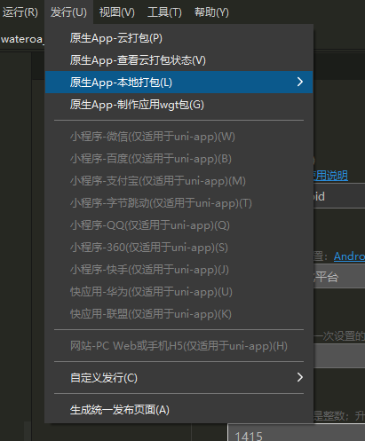
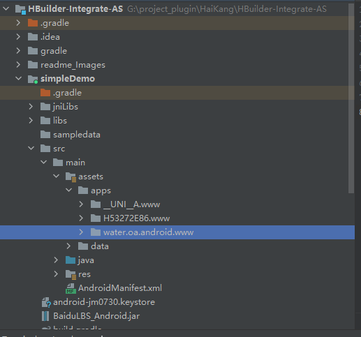
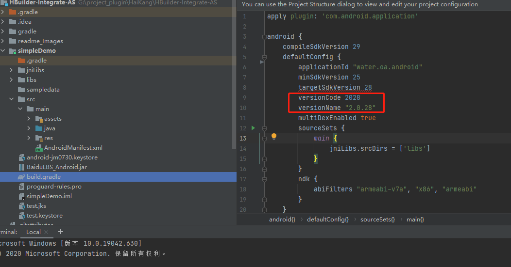
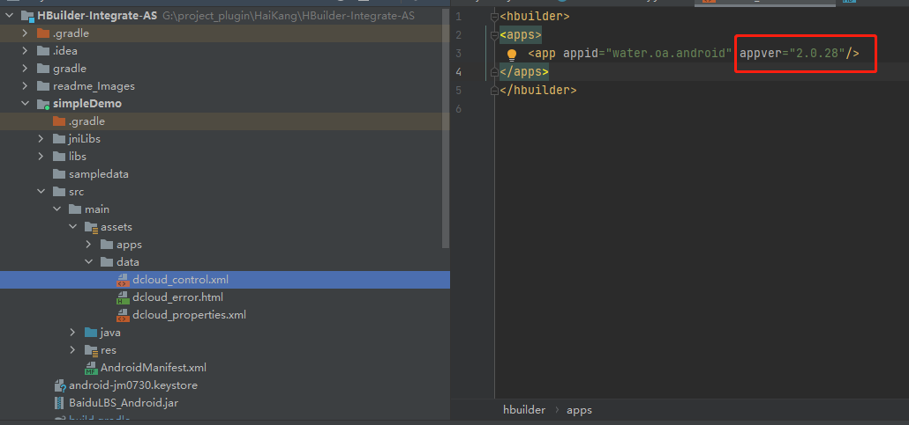
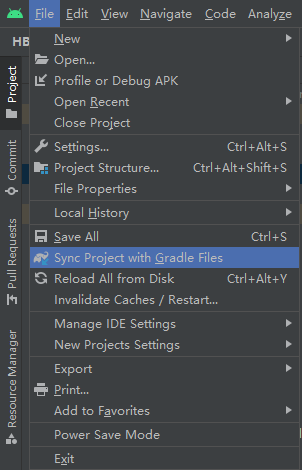
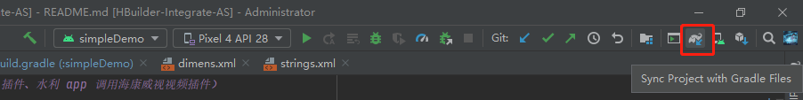
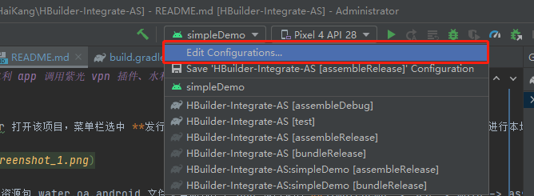
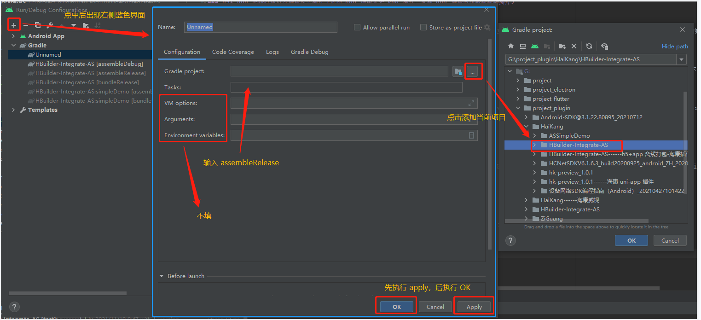
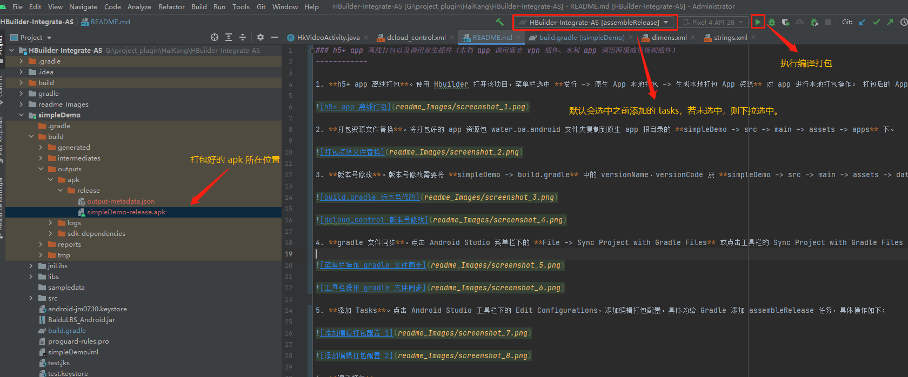

### h5+ app 离线打包以及调用原生插件（水利 app 调用紫光 vpn 插件、水利 app 调用海康威视视频插件）
------------

1. **h5+ app 离线打包**。使用 Hbuilder 打开该项目，菜单栏选中 **发行 -> 原生 App 本地打包 -> 生成本地打包 App 资源** 对 app 进行本地打包操作。 打包后的 App 资源为项目根目录下的文件夹 **unpackage -> resources -> water.oa.android**。

    

2. **打包资源文件替换**。将打包好的 app 资源包 water.oa.android 文件夹复制到原生 app 根目录的 **simpleDemo -> src -> main -> assets -> apps** 下。

    

3. **版本号修改**。版本号修改需要将 **simpleDemo -> build.gradle** 中的 versionName、versionCode 及 **simpleDemo -> src -> main -> assets -> data -> dcloud_control.xml** 中的 appver 修改为相应参数。

    
    
    

4. **gradle 文件同步**。点击 Android Studio 菜单栏下的 **File -> Sync Project with Gradle Files** 或点击工具栏的 Sync Project with Gradle Files 图标按钮，同步 gradle 文件。

    
    
    

5. **添加 Tasks**。点击 Android Studio 工具栏下的 Edit Configurations，添加编辑打包配置，具体为给 Gradle 添加 assembleRelease 任务，具体操作如下：

    
    
    

6. **编译打包**。选中之前添加的 Tasks（会默认选中），点击工具栏的执行图标按钮，进行编译打包。打包好的 apk 文件位置在根目录下的 **simpleDemo -> build -> outputs -> release -> simpleDemo-release.apk**，（复制 apk 到一固定文件夹，方便记录不同版本 apk），修改 apk 名称后发布。

    